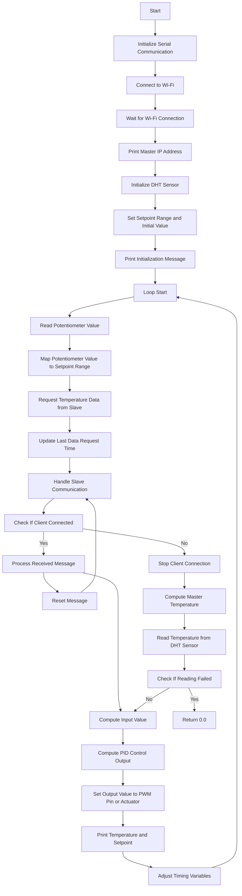

# Master Code
This folder contains the Arduino code for the master board in the Temperature Control System with Multiple DHT11 Sensors. The master board is responsible for temperature calculation and control.

## Usage
1. Connect the master board to power and upload the code to the board using the Arduino IDE.
2. Adjust the Wi-Fi credentials in the code to match your network settings.
3. Connect a DHT11 sensor to the master board and configure the appropriate pin in the code.
4. Connect a potentiometer to the master board and adjust the pin configuration in the code.
5. Open the serial monitor to view the temperature readings and control actions.

## Code Explanation
- The code initializes the DHT sensor and Wi-Fi connection.
- It sets the desired setpoint temperature range and adjusts the temperature calculation and data request intervals based on the number of connected slave boards.
- The master board reads the potentiometer value to set the desired setpoint temperature.
- It requests temperature data from the slave boards at regular intervals.
- Upon receiving the temperature data, it calculates the average temperature based on the number of connected slaves and the master temperature.
- The PID control algorithm computes the control output, which is set as the PWM output or actuator value.
- The code adjusts the timing intervals based on the number of connected slaves to optimize communication.

## Flowchart 

Note: Make sure to update the IP address of the master board in the code to match your network configuration.
