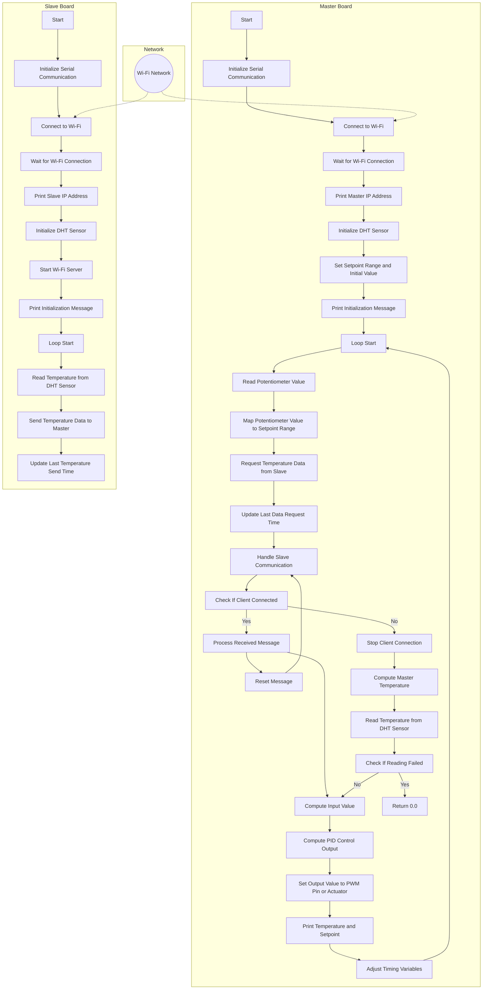

# Temperature Control System with Multiple DHT11 Sensors using ESP8266
This repository contains code for a temperature control system implemented using Arduino and ESP8266 boards. The system utilizes multiple DHT11 sensors to measure temperature and applies PID control to maintain a desired setpoint temperature. The system consists of two components: the master board and the slave board. The master board performs temperature calculation and control, while the slave board collects temperature data from DHT11 sensors. The master and slave boards communicate with each other over Wi-Fi.

## Features
- Multiple DHT11 sensors connected to the slave board for temperature measurement
- PID control algorithm for precise temperature regulation
- Wi-Fi communication between master and slave boards
- Automatic adjustment of timing intervals based on the number of connected slaves

## Contents
- master_code.ino: Arduino code for the master board
- slave_code.ino: Arduino code for the slave board
- README.md: Instructions and explanations for using the code

## Requirements
- Arduino IDE
- ESP8266 board
- DHT library

## Usage
1. Connect the master and slave boards to the same Wi-Fi network.
2. Upload the respective code (master_code.ino for the master board and slave_code.ino for the slave board) to their respective boards.
3. Open the serial monitor for each board to view the temperature readings and control actions.

## Flowchart

## Contribution
Contributions to the code and project are welcome. Feel free to submit issues or pull requests for any improvements or bug fixes.
